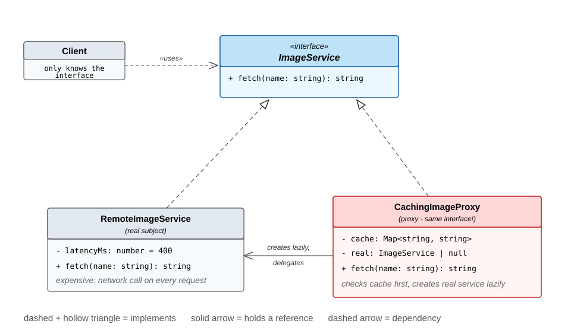

<!-- _paginate: false -->

# The Proxy Pattern

**Structural Design Patterns – Barcamp Session**

Cebrail K. & Tiago D. · 60 minutes

---

## Agenda

- 0–9: Welcome, warm-up, and the problem
- 9–22: What is a Proxy, UML, live coding the caching proxy
- 22–31: Protection proxy, pattern comparison, and one wow moment
- 31–46: Hands-on in pairs: build your own proxy
- 46–52: Model answer
- 52–60: Big picture, wrap-up and feedback

---

## Warm-up

Raise your hand if you have used ...

- a VPN
- a credit card
- a bouncer in front of a club

All three stand in front of something else and control access to it.
A Proxy does the same for objects.

---

## The problem

A gallery app talks directly to a remote image service:

```ts
service.fetch("cat.png");   // 400 ms network call
service.fetch("dog.png");
service.fetch("cat.png");   // same file, downloaded again
// ... 6 requests, only 3 different pictures -> 2400 ms
```

Demo: `npm run demo1` - watch the clock, then tell me what is wrong.

What we find:

- the same file gets downloaded three times
- everything loads eagerly, first paint is slow
- anyone can call anything, there is no access control
- the client is hard-wired to one concrete class

---

## What is a Proxy?

> A proxy is a stand-in object with the same interface as the real service.
> Clients talk to the proxy, and the proxy decides whether, when and how
> the real service gets used.

- belongs to the structural patterns (GoF), like Adapter, Decorator, Facade
- original intent: "Provide a surrogate or placeholder for another object
  to control access to it."
- the client code does not change at all

---

## Analogies

- Bouncer: controls who gets in (protection)
- Credit card: money you do not carry with you (virtual)
- VPN: your request takes a different route (remote)
- Notary: records every signature (logging)

Always the same idea: stand in front, add control, keep the interface.

---

## One interface, two implementations



---

## One shared interface

```ts
interface ImageService {              // both implement this
  fetch(filename: string): string;
}

class CachingImageProxy implements ImageService {
  private cache = new Map<string, string>();
  private real: ImageService | null = null;   // lazy

  fetch(name: string): string {
    const hit = this.cache.get(name);
    if (hit !== undefined) return hit;        // cache first (not `if (hit)`!)
    this.real ??= new RemoteImageService();   // create on first use
    const data = this.real.fetch(name);       // delegate
    this.cache.set(name, data);               // remember
    return data;
  }
}
```

Demo: `npm run demo2` -> 2400 ms becomes 1200 ms, same client code

---

## Protection proxy

```ts
delete(docId: string, user: User): void {
  if (user.role !== "admin") {
    console.log("403 - only admins may delete");
    return;                        // never reaches the store
  }
  this.real.delete(docId, user);   // authorized, delegate
}
```

The real store stays simple. It can assume that every call it receives
was already checked by someone else.

Demo: `npm run demo3`

---

## Proxy vs. similar patterns

| Pattern | Interface | The question it answers |
|---|---|---|
| **Proxy** | same | May this call happen, and when? |
| Decorator | same | What else should happen around it? |
| Adapter | different | How do I make these two fit together? |
| Facade | new, simpler | How do I front a whole subsystem? |

**The sharpest test:** a decorator *always* delegates. A proxy may decide
**never to call the real object at all** - cache hit, denied permission,
object not created yet. If your wrapper can return without touching the
real thing, it is a proxy.

---

## Logging and timing

Logging, metrics, tracing: useful for us, but they do not belong inside
the business class.

```ts
getTemperature(city: string): number {
  const start = performance.now();
  const result = this.real.getTemperature(city);
  console.log(`getTemperature("${city}") took ${performance.now() - start} ms`);
  return result;
}
```

No demo for this one - you can already see the problem:
we just wrote the **same wrapper** for every single method.

---

## JavaScript has this built in

```ts
function withLogging<T extends object>(target: T): T {
  return new Proxy(target, {
    get(obj, prop) { /* wraps every method automatically */ }
  });
}
```

One handler covers all methods of any object.

Vue 3 reactivity and MobX are built on exactly this.

Demo: `npm run demo5`

---

## Hands-on (15 min, in pairs)

**Mission: make the slow quote app fast.**

Open `workshop.html` → scroll to **Your turn**

1. Implement `CachingQuoteProxy`: fetch every topic **once**,
   repeated requests come from your cache
2. The client code stays untouched
3. Press **Check** - it names exactly what still fails

Stuck? **Show a hint** - four of them, one at a time.
Finished early? Exercise 2 is right below it.

---

## Pros and cons

Pros:

- access control without touching the real class
- lazy loading and caching can save a lot of time
- old clients keep working when you add a proxy

Cons:

- more classes, more indirection
- an extra layer can hide where time is spent
- easy to overuse

---

## Where you meet proxies in real life

- lazy-loaded images (`loading="lazy"` in the browser)
- Express middleware around route handlers
- API clients with retry, rate limiting or caching
- Vue 3 / MobX reactivity (native JS `Proxy`)
- ORMs: relations load from the database only when used

---

## Summary

1. A proxy has the same interface as the real object and stands in front of it
2. It controls when, how and who: lazy, cached, guarded, logged
3. The client code stays unchanged
4. Do not mix it up with Decorator or Adapter

Feedback: Fist-to-Five. How useful was this session for you?

Thanks, and questions if you have any.
